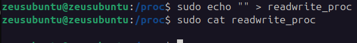
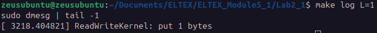
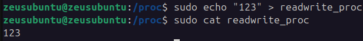
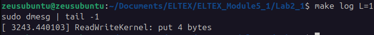
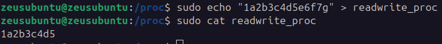
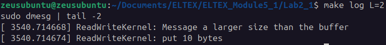

# Лабораторная работа №2

### Задание
Написать модуль ядра для своей версии ядра, который будет обмениваться 
информацией с userspace через proc

### Ход работы
1) Написать программу 
    
 - ##### **readwritekernel.c**

```C
#include <linux/module.h>
#include <linux/kernel.h>
#include <linux/proc_fs.h>
#include <linux/sched.h>
#include <linux/uaccess.h>
#include <linux/slab.h>
 
#define BUFSIZE 10
#define PROC_NAME "readwrite_proc"
#define PROC_ACCESS_RIGHT 666

static int msg_len;
static char *msg;
 
int init_proc (void);
void cleanup_proc(void);

void create_new_entry_proc(void);

ssize_t read_proc(struct file *, char *, size_t , loff_t * );
ssize_t write_proc(struct file *, const char *, size_t , loff_t *);

static const struct proc_ops proc_fops = 
{
    proc_read: read_proc,
    proc_write: write_proc,
};

ssize_t read_proc(struct file *filp, char *buf, size_t count, loff_t *offp ) 
{
    static int finished = 0;
    if (finished) 
    {
        finished = 0;
        return 0;
    }
    finished = 1;

    copy_to_user(buf, msg, msg_len);

    return msg_len;
}

ssize_t write_proc(struct file *filp, const char *buf, size_t count, loff_t *offp) 
{
    int in_msg_len = count < BUFSIZE ? count : BUFSIZE;

    memset(msg, '\0', BUFSIZE);

    copy_from_user(msg, buf, in_msg_len);

    if(count >= BUFSIZE)
    {
        msg[BUFSIZE - 1] = '\n';
        pr_alert("ReadWriteKernel: Message a larger size than the buffer\n");
    }
    
    pr_info("ReadWriteKernel: put %d bytes\n", in_msg_len);

    msg_len = in_msg_len;

    return count;
}

void create_new_entry_proc(void) 
{
    proc_create(PROC_NAME, PROC_ACCESS_RIGHT, NULL, &proc_fops);
    msg = kmalloc(BUFSIZE * sizeof(char), GFP_KERNEL);
}

int init_proc (void) {
    create_new_entry_proc();
    pr_info("ReadWriteKernel ON!\n");
    return 0;
}
 
void cleanup_proc(void) {
    remove_proc_entry(PROC_NAME, NULL);
    kfree(msg);
    pr_info("ReadWriteKernel OFF!\n");
}
 
MODULE_LICENSE("ELTEX");
MODULE_AUTHOR("Loychenko");
module_init(init_proc);
module_exit(cleanup_proc);
```

 - ##### Makefile
```Makefile
obj-m += readwritekernel.o

all:
	make -C /lib/modules/$(shell uname -r)/build M=$(PWD) modules
clean:
	make -C /lib/modules/$(shell uname -r)/build M=$(PWD) clean
ins:
	sudo insmod readwritekernel.ko
rm:
	sudo rmmod readwritekernel.ko
log:
	sudo dmesg | tail -$L
```
### Тестирование программы
1) Пустое сообщение
   - Консоль
     
    
   - Лог
     
   
   
*Скорей всего добавился признак конца строки '\0'*

3) Собщение не превышающее размер буфера
   - Консоль
     
   
   - Лог
     
   

5) Собщение превышающее размер буфера
   - Консоль
     
    
   - Лог
     
   
   
*Как видно в лог добавилось предупреждение о превашении длины сообщения*
