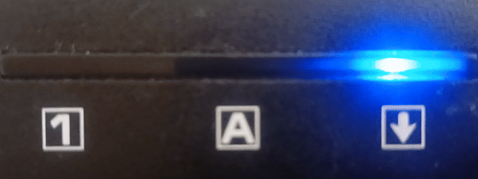
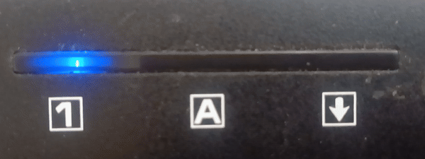
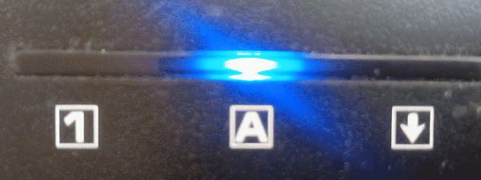
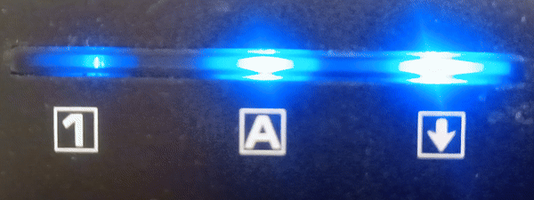

# Лабораторная работа №3

### Задание
Сделать управление морганием лампочек на клавиатуре используя sysfs

### Текст программы

- ##### sysleds.c

```C
#include <linux/module.h>
#include <linux/configfs.h>
#include <linux/tty.h>          
#include <linux/kd.h>          
#include <linux/vt.h>
#include <linux/console_struct.h>       
#include <linux/vt_kern.h>
#include <linux/timer.h>

#define BLINK_DELAY   HZ/5
#define ALL_LEDS_ON   0x07
#define RESTORE_LEDS  0xFF
#define MY_SYS_NAME "mysysled"

struct timer_list my_timer;
struct tty_driver *my_driver;
static int _kbledstatus = 0;
static int led_settings = 7; // code

static struct kobject *my_kobject;

static ssize_t foo_show(struct kobject *kobj, struct kobj_attribute *attr, char *buf)
{
        return sprintf(buf, "%d\n", led_settings);
}

static ssize_t foo_store(struct kobject *kobj, struct kobj_attribute *attr, const char *buf, size_t count)
{
        sscanf(buf, "%du", &led_settings);
        return count;
}
 
static struct kobj_attribute foo_attribute =__ATTR(led_settings, 0660, foo_show, foo_store);

static void my_timer_func(struct timer_list *ptr)
{
        int *pstatus = &_kbledstatus;
        if (*pstatus == led_settings)
                *pstatus = RESTORE_LEDS;
        else
                *pstatus = led_settings;
        (my_driver->ops->ioctl) (vc_cons[fg_console].d->port.tty, KDSETLED, *pstatus);
        my_timer.expires = jiffies + BLINK_DELAY;
        add_timer(&my_timer);
}
static int __init kbleds_init(void)
{       
        int error = 0;
 
        my_kobject = kobject_create_and_add(MY_SYS_NAME, kernel_kobj);
        if(!my_kobject)
                return -ENOMEM;
 
        error = sysfs_create_file(my_kobject, &foo_attribute.attr);
        if (error) {
                pr_debug("sysleds: Failed to create the file in /sys/kernel/systest \n");
        }

        int i;
        printk(KERN_INFO "sysleds: loading\n");
        printk(KERN_INFO "sysleds: fgconsole is %x\n", fg_console);
        for (i = 0; i < MAX_NR_CONSOLES; i++) {
                if (!vc_cons[i].d)
                        break;
                printk(KERN_INFO "sysleds: console[%i/%i] #%i, tty %lx\n", i,
                       MAX_NR_CONSOLES, vc_cons[i].d->vc_num,
                       (unsigned long)vc_cons[i].d->port.tty);
        }
        
        my_driver = vc_cons[fg_console].d->port.tty->driver;

        timer_setup(&my_timer, my_timer_func, 0);
        my_timer.expires = jiffies + BLINK_DELAY;
        add_timer(&my_timer);
        
        printk(KERN_INFO "sysleds: ON!\n");
        return error;
}
static void __exit kbleds_cleanup(void)
{
        printk(KERN_INFO "sysleds: OFF!\n");
        del_timer(&my_timer);
        (my_driver->ops->ioctl) (vc_cons[fg_console].d->port.tty, KDSETLED, RESTORE_LEDS);
}


MODULE_LICENSE("GPL");
MODULE_AUTHOR("Loychenko");
module_init(kbleds_init);
module_exit(kbleds_cleanup);
```

- ##### Makefile
```Makefile
obj-m += sysleds.o

all:
	make -C /lib/modules/$(shell uname -r)/build M=$(PWD) modules

clean:
	make -C /lib/modules/$(shell uname -r)/build M=$(PWD) clean
ins:
	sudo insmod sysleds.ko
rm:
	sudo rmmod sysleds.ko
log:
	sudo dmesg | tail -$L
```

### Тестирование программы
1) echo 1 > led_settings

   
   
   
3) echo 2 > led_settings

   
   

4) echo 4 > led_settings

   
   

5) echo 7 > led_settings

   
   

6) echo 10 > led_settings

   

При значениях вне области $[1,7]$ на клавиатуре ничего не горит
