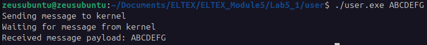

# Лабораторная работа №5

### Задание
Написать модуль ядра для своей версии ядра, который будет обмениваться информацией с userspace через netlink. 

### Текст программ

- ##### netlinkKernelSpace.c

```C
#include <linux/module.h>
#include <net/sock.h>
#include <linux/netlink.h>
#include <linux/skbuff.h>
#include <net/net_namespace.h>

#define NETLINK_USER 31

struct sock *nl_sk = NULL;

static void hello_nl_recv_msg(struct sk_buff *skb)
{
    struct nlmsghdr *nlh;
    int pid;
    struct sk_buff *skb_out;
    int msg_size;
    char msg[32];
    int res;

    pr_info("netlink: Message entering \n");

    msg_size = strlen(msg);

    nlh = (struct nlmsghdr *)skb->data;
    pr_info("netlink: Netlink received msg payload: %s\n", (char *)nlmsg_data(nlh));
    strcpy(msg,  (char *)nlmsg_data(nlh));
    pid = nlh->nlmsg_pid; 

    skb_out = nlmsg_new(msg_size, 0);

    if (!skb_out)
    {
        pr_err("netlink: Failed to allocate new skb\n");
        return;
    }

    nlh = nlmsg_put(skb_out, 0, 0, NLMSG_DONE, msg_size, 0);
    NETLINK_CB(skb_out).dst_group = 0;
    
    strncpy(nlmsg_data(nlh), msg, msg_size);

    res = nlmsg_unicast(nl_sk, skb_out, pid);

    if (res < 0)
        pr_info("netlink: Error while sending bak to user\n");
}

struct netlink_kernel_cfg cfg = {
   .groups  = 1,
   .input = hello_nl_recv_msg,
};

static int __init hello_init(void)
{
    nl_sk = netlink_kernel_create(&init_net, NETLINK_USER, &cfg);

    if (!nl_sk)
    {
        printk(KERN_ALERT "netlink: Error creating socket.\n");
        return -10;
    }

    pr_info("netlink: ON!");
    return 0;
}

static void __exit hello_exit(void)
{
    pr_info("netlink: OFF!\n");
    netlink_kernel_release(nl_sk);
}

MODULE_LICENSE("GPL");
MODULE_AUTHOR("Loychenko");
MODULE_DESCRIPTION("The program that using NETLINK");
module_init(hello_init);
module_exit(hello_exit);
```

- ##### netlinkUserSpace.c
```C
#include <stdlib.h>
#include <string.h>
#include <stdio.h>
#include <sys/socket.h>
#include <linux/netlink.h>

#define NETLINK_USER 31

#define MAX_PAYLOAD 1024
struct sockaddr_nl src_addr, dest_addr;
struct nlmsghdr *nlh = NULL;
struct iovec iov;
int sock_fd;
struct msghdr msg;

void main(int argc, char *argv[])
{
    if(argc != 2)
        return;
    
    sock_fd = socket(PF_NETLINK, SOCK_RAW, NETLINK_USER);
    if (sock_fd < 0)
        return;

    memset(&src_addr, 0, sizeof(src_addr));
    src_addr.nl_family = AF_NETLINK;
    src_addr.nl_pid = getpid();

    bind(sock_fd, (struct sockaddr *)&src_addr, sizeof(src_addr));

    memset(&dest_addr, 0, sizeof(dest_addr));
    memset(&dest_addr, 0, sizeof(dest_addr));
    dest_addr.nl_family = AF_NETLINK;
    dest_addr.nl_pid = 0; 
    dest_addr.nl_groups = 0; 

    nlh = (struct nlmsghdr *)malloc(NLMSG_SPACE(MAX_PAYLOAD));
    memset(nlh, 0, NLMSG_SPACE(MAX_PAYLOAD));
    nlh->nlmsg_len = NLMSG_SPACE(MAX_PAYLOAD);
    nlh->nlmsg_pid = getpid();
    nlh->nlmsg_flags = 0;

    strcpy(NLMSG_DATA(nlh), argv[1]);

    iov.iov_base = (void *)nlh;
    iov.iov_len = nlh->nlmsg_len;
    msg.msg_name = (void *)&dest_addr;
    msg.msg_namelen = sizeof(dest_addr);
    msg.msg_iov = &iov;
    msg.msg_iovlen = 1;

    printf("Sending message to kernel\n");
    sendmsg(sock_fd, &msg, 0);
    printf("Waiting for message from kernel\n");

    recvmsg(sock_fd, &msg, 0);
    printf("Received message payload: %s\n", NLMSG_DATA(nlh));
    close(sock_fd);
}
```

### Результат работы программы

   
